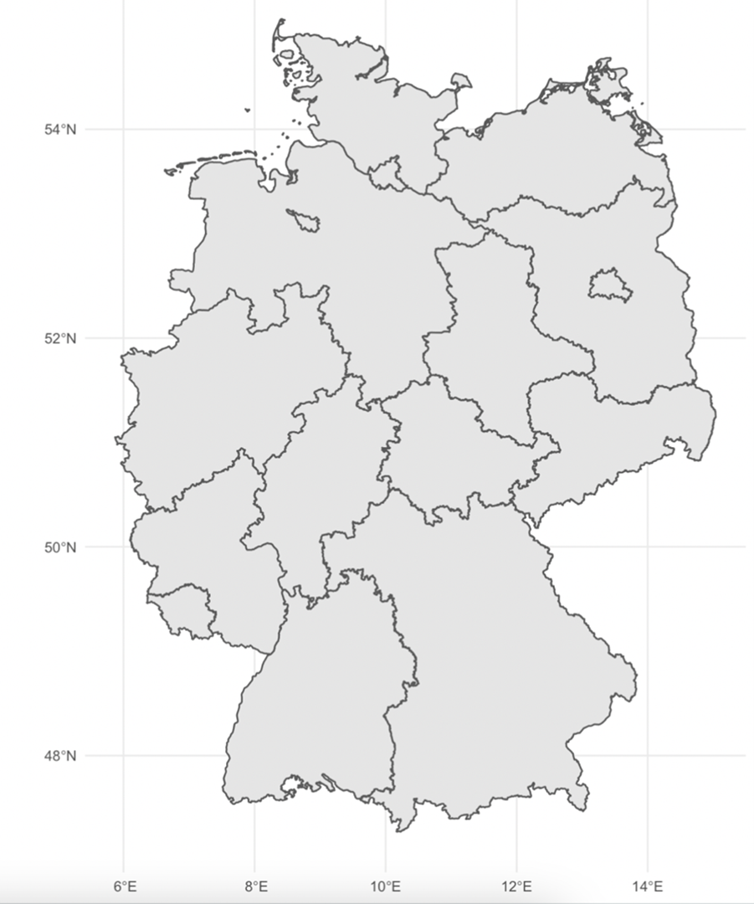
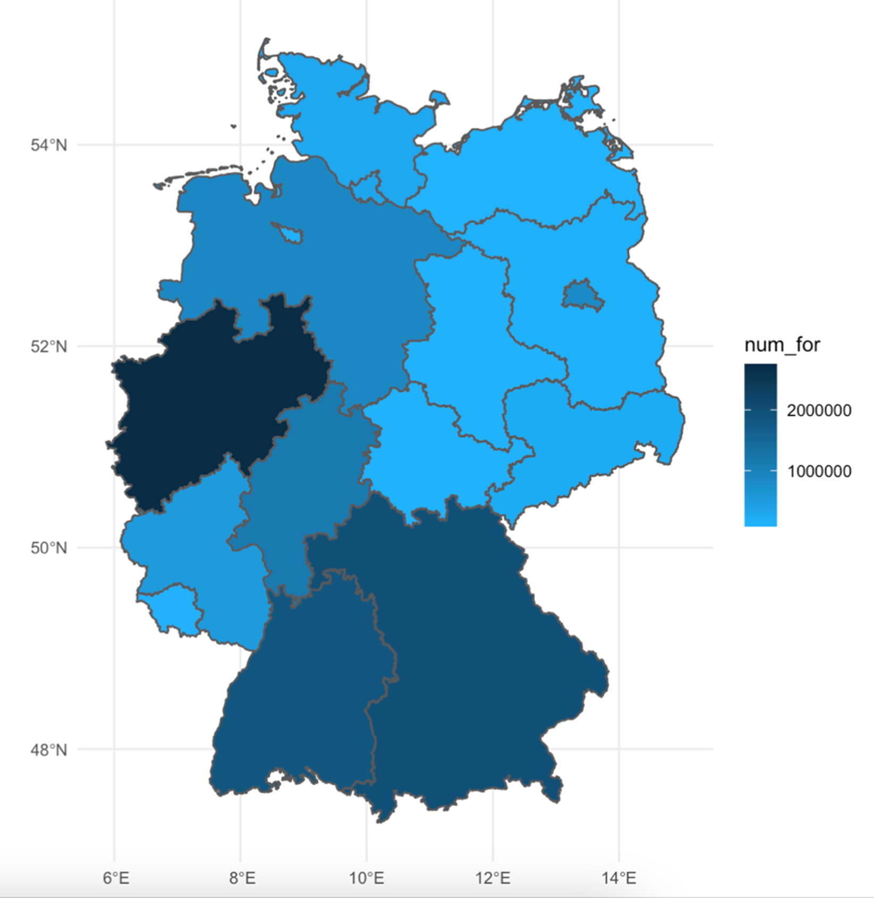
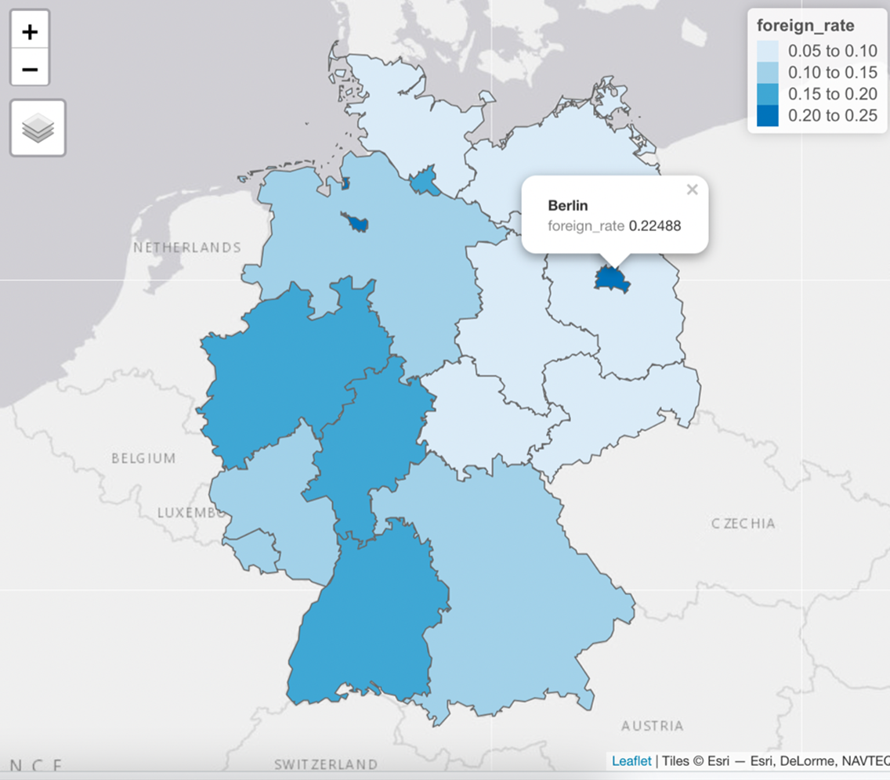
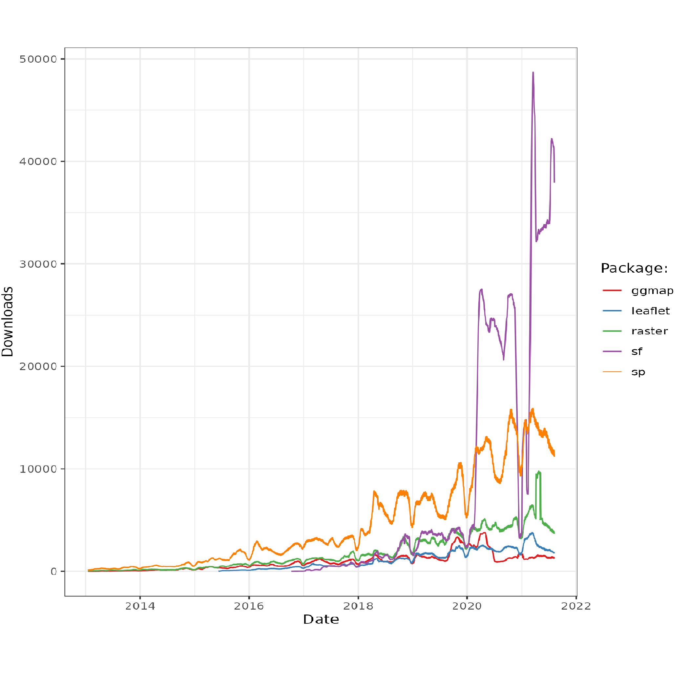
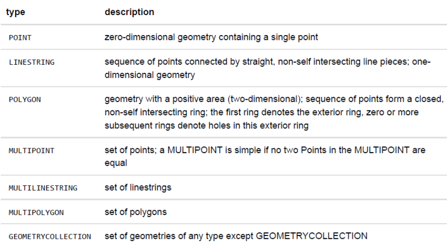

```{r setup, include=FALSE}
# figures formatting setup
options(htmltools.dir.version = FALSE)
library(knitr)
opts_chunk$set(
  prompt = T,
  fig.align="center", #fig.width=6, fig.height=4.5, 
  # out.width="748px", #out.length="520.75px",
  dpi=300, #fig.path='Figs/',
  cache=F, #echo=F, warning=F, message=F
  engine.opts = list(bash = "-l")
  )

## Next hook based on this SO answer: https://stackoverflow.com/a/39025054
knit_hooks$set(
  prompt = function(before, options, envir) {
    options(
      prompt = if (options$engine %in% c('sh','bash')) '$ ' else 'R> ',
      continue = if (options$engine %in% c('sh','bash')) '$ ' else '+ '
      )
})

library(tidyverse)
library(devtools)
library(dplyr)
library(sf)
library(knitr)
library(kableExtra)
```

# Table of contents

<br>

1. [What is the package good for?](#Introduction)

2. [How can we use it?](#Logic)

3. [Key Features](#Tools)

4. [Practical Application](#TutorialPreview)

5. [Learn More](#Sources)

---
class: inverse, center, middle
name: Introduction

# What is the package good for?
<br>
Geocoding, spatial analysis and SF

<html><div style='float:left'></div><hr color='#EB811B' size=1px style="width:1000px; margin:auto;"/></html>

---
#What is **geocoding**? `r emo::ji("globe")` `r emo::ji("location")`
<br>

Process of *taking an address or a name of a place and turning it into a geographic position on the earth’s surface.*

<div align="center">

</div>

`r emo::ji ("check")` Input Data: Relative or Absolute
<br>
<br>
`r emo::ji("search")` Coordinate System: Longitude and Latitude

---
#Why do **spatial analysis**? `r emo::ji("map")`

.pull-left[
<center>
*The performance of analytic tasks that explicitly incorporate the spatial properties of a dataset.*
</center>
<br>
<div align="center">

</div>
]

.pull-right[
**Relevance for Public Policies**
- public health, such as the pandemic evolution
<br>
- security, such as crime trends
<br>
<div align="center">



</div>
<br>
In its best form, allows people to easily understand complex geographical information: *Adding more information conveys and increasingly rich and informative story*
]

---
#The **SF** package `r emo::ji("coder")``r emo::ji("coder")``r emo::ji("coder")`

.pull-left[
- Geographic information science has been performed in a geographic information system (“GIS”), which is an integrated software platform for the management, processing, analysis, and visualization of geographic data

- R packages exist for handling these tasks, allowing R to function as a capable substitute
<br>
<div align="center">

</div>
]

.pull-right[
<br>
<div align="center">

</div>
- The next-generation alternative to sp for spatial data analysis in R <br>
- Advantages: <br>
  * sf objects can be treated as data frames in most operations
  <br>
  * sf function names are relatively consistent and intuitive
  <br>
  * sf functions can be combined using %>% operator
  * `r emo::ji("thumb")` integrates seamlessly with **tidyverse tools** `r emo::ji("thumb")`
<br>
]

---
class: inverse, center, middle
name: Logic

# How can we use it??
<br>
Geometry basics

<html><div style='float:left'></div><hr color='#EB811B' size=1px style="width:1000px; margin:auto;"/></html>

---
.pull-left[
###Simple features
<br>
thing or a object, which have "a **geometry** describing where on Earth is located (*spatial attribute*), and other attributes, which describe other properties (non-spatial attributes)"
<br>
- Dimensions or coordinates: X and Y (longitude and latitude), Z (altitude) and M 
(denotes some associated measure, such as time of measurement)
<br>
<div align="center">

</div>
]


.pull-right[
- Geometry types
<div align="center">

</div>
###Shape files
- The way as *geographic information* is normally shared
- zip file with a **.shp**, which stores the geographic coordinates of the geographic features (e.g. country, state, county)
]

---
class: inverse, center, middle
name: Tools

# Key Features
<br>
Tools

<html><div style='float:left'></div><hr color='#EB811B' size=1px style="width:1000px; margin:auto;"/></html>

---
#*SF*: reading, writing, handling, and manipulating simple features in R

| st_read  |  st_as_sf |
|---|---|
| imports a spatial data file and converts <br> it to a simple feature *data frame* | *convert* foreign object to an sf object|
|
<br>
<div align="center">

</div>

---
class: inverse, center, middle
name: TutorialPreview

# Pratical Application
<br>
Tutorial Preview

<html><div style='float:left'></div><hr color='#EB811B' size=1px style="width:1000px; margin:auto;"/></html>

---
#How to?

### Downloading and Visualizing geometric data
```{r}
# Save file as a .zip with link
brazil_file <- "https://biogeo.ucdavis.edu/data/diva/adm/BRA_adm.zip"
 
# Download .zip
download.file(brazil_file, destfile = "BRA.zip")
 
# Unzip the file
unzip("BRA.zip")
 
# Examine the file .zip file (list()) to find the shapefile and then save the shapefile as a dataframe
brazil <- sf::read_sf("BRA_adm1.shp")
```
---

###The Geometry column

```{r}
brazil %>%
  dplyr::select(geometry) %>%
  knitr::kable(col.names = c("Geometry")) %>%
  kableExtra::kable_minimal()
```
---
###But if I don't have a geometry column?
.pull-left[
- Longitude and Latitude

```{r,  results='hide',  message=FALSE, warning=FALSE}
coordinates_br <- readr::read_csv("br.csv")
```

You will need to check the **CRS** (coordinate reference system) code
```{r, results='hide',message=FALSE, warning=FALSE}
sf::st_crs(brazil)
```
In our case: "EPSG",4326
]
.pull-right[
Then, conversion
```{r}
coord_geo <- coordinates_br %>%
  sf::st_as_sf(coords = c("lng", "lat"), crs = 4326)

coord_geo %>%
  dplyr::select(geometry) %>%
  knitr::kable(col.names = c("Geometry")) %>%
  kableExtra::kable_minimal()
```
]
---
#Next Steps
.pull-left[
What about when I don't have longitude and latitude?
<br>
`r emo::ji("globe")`**geocoding**
<br>
<br>
And what about spatial analysis?
```{r, results='hide', message=FALSE, warning=FALSE}
brplot <- ggplot2::ggplot() +
  geom_sf(data = brazil) +
  geom_sf(data = coord_geo %>%
            dplyr::filter(!is.na(capital)), color = "aquamarine") +
   geom_sf_label(data = coord_geo %>%
                dplyr::filter(population_proper >= 1500000 & population_proper <= 7000000),
                aes(label = city),  size = 3, hjust = 0, color = "aquamarine4")
```
]
.pull-right[
```{r, error=FALSE, message=FALSE, warning=FALSE}
brplot
```
]
---
class: inverse, center, middle
name: Sources

# Learn More
<br>
Sources

<html><div style='float:left'></div><hr color='#EB811B' size=1px style="width:1000px; margin:auto;"/></html>

---
